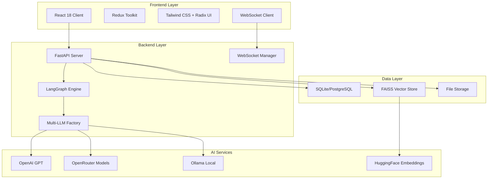

# Smart AI Assistant

> Enterprise-grade intelligent data analysis platform combining natural language processing with advanced workflow orchestration

[](https://opensource.org/licenses/MIT)
[](https://python.org)
[](https://reactjs.org)
[](https://fastapi.tiangolo.com)
[](https://langchain.com)

## 🎯 Project Overview

Smart AI Assistant is a sophisticated full-stack platform that demonstrates the integration of cutting-edge AI technologies with enterprise data management. The system combines React-based frontend interfaces with a powerful FastAPI backend, featuring LangGraph workflow orchestration, multi-LLM support, and real-time data processing capabilities.

### 🌟 Key Highlights

- **🧠 Advanced AI Processing**: LangGraph-powered workflow orchestration with multi-step reasoning
- **🔄 Real-time Monitoring**: WebSocket-based live workflow execution tracking
- **📊 Intelligent Data Analysis**: Natural language queries with automated chart generation
- **🗂️ Multi-source Data Integration**: SQL databases, document repositories, and hybrid data sources
- **🌐 Modern Architecture**: React 18 frontend with FastAPI backend and enterprise-grade scalability
- **🔧 Multi-LLM Support**: OpenAI, OpenRouter, and Ollama integration with unified configuration

## 🏗️ System Architecture



## 🚀 Features

### Frontend Capabilities
- **📱 Modern React Interface**: Built with React 18, Redux Toolkit, and Tailwind CSS
- **🎨 Professional UI Components**: Radix UI-based design system with dark/light theme support
- **🌍 Internationalization**: Multi-language support (English/Chinese) with i18next
- **📊 Interactive Visualizations**: Real-time charts and data dashboards
- **⚡ Real-time Updates**: Live workflow monitoring with WebSocket integration
- **🔍 Node Inspection**: Detailed workflow step analysis and debugging tools

### Backend Capabilities
- **🔄 LangGraph Workflows**: Sophisticated AI processing pipelines with error recovery
- **🤖 Multi-LLM Integration**: Seamless switching between OpenAI, OpenRouter, and Ollama
- **📁 Intelligent File Processing**: Support for CSV, PDF, Word, Excel, and text documents
- **🔍 Hybrid Data Sources**: SQL queries, document search, and combined reasoning
- **🌐 WebSocket Broadcasting**: Real-time client notifications and status updates
- **🛡️ Enterprise Security**: Comprehensive error handling and validation

## 🛠️ Technology Stack

### Frontend Technologies
| Category | Technology | Purpose |
|----------|------------|---------|
| **Framework** | React 18 | Modern component-based UI |
| **State Management** | Redux Toolkit | Predictable state container |
| **Styling** | Tailwind CSS + Radix UI | Utility-first CSS + accessible components |
| **Build Tool** | Vite | Fast development and build |
| **Internationalization** | i18next | Multi-language support |
| **HTTP Client** | Axios | API communication |
| **Real-time** | WebSocket | Live data updates |

### Backend Technologies
| Category | Technology | Purpose |
|----------|------------|---------|
| **Framework** | FastAPI | High-performance async web framework |
| **AI Orchestration** | LangGraph | Workflow management and execution |
| **LLM Integration** | LangChain | AI model abstraction and chaining |
| **Vector Database** | FAISS | Similarity search and embeddings |
| **Database** | SQLAlchemy + SQLite/PostgreSQL | Data persistence |
| **Document Processing** | PyPDF2, python-docx, openpyxl | File parsing |
| **Embeddings** | Sentence Transformers | Local text embeddings |
| **Real-time** | WebSocket Manager | Connection management |

## 📦 Project Structure

```
smart-ai-assistant/
├── client/                     # React Frontend Application
│   ├── src/
│   │   ├── components/         # React components
│   │   │   ├── Dashboard.jsx   # Main dashboard interface
│   │   │   ├── IntelligentAnalysis.jsx # AI workflow interface
│   │   │   ├── DataSourceManager.jsx  # Data source management
│   │   │   └── ui/            # Reusable UI components
│   │   ├── hooks/             # Custom React hooks
│   │   ├── store/             # Redux store configuration
│   │   ├── services/          # API service layer
│   │   └── locales/           # Internationalization files
│   ├── package.json           # Frontend dependencies
│   └── README.md              # Frontend documentation
├── server/                     # FastAPI Backend Application
│   ├── src/                   # Core application package
│   │   ├── agents/           # AI agent implementations
│   │   ├── api/              # API endpoints and routes
│   │   ├── chains/           # LangChain workflow definitions
│   │   ├── components/       # Reusable components
│   │   ├── config/          # Configuration management
│   │   ├── database/        # Database operations
│   │   ├── document_loaders/ # File processing and loading
│   │   ├── models/          # Data models and factories
│   │   ├── prompts/         # LLM prompts and templates
│   │   ├── utils/           # Utility functions
│   │   ├── vectorstores/    # Vector storage implementations
│   │   ├── websocket/       # WebSocket management
│   │   └── main.py         # FastAPI application entry
│   ├── data/                # Data storage directory
│   │   ├── embeddings_cache/ # Embedding model cache
│   │   ├── reports/        # Generated reports
│   │   ├── resume/         # Resume storage
│   │   ├── sample_sales/   # Sample data
│   │   ├── uploads/        # File uploads
│   │   └── smart.db       # SQLite database
│   ├── requirements.txt    # Python dependencies
│   └── README.md          # Backend documentation
├── docs/                  # Project documentation
│   └── data/             # Sample data files
├── package.json          # Root package configuration
└── README.md            # This file
```

## 🚀 Quick Start

### Prerequisites

- **Node.js 16+** with npm/yarn
- **Python 3.8+** with pip
- **Git** for version control

### Installation

1. **Clone the repository**
```bash
git clone <repository-url>
cd smart-ai-assistant
```

2. **Install dependencies**
```bash
# Install root dependencies
npm install

# Install frontend dependencies
cd client
npm install
cd ..

# Install backend dependencies
cd server
python -m venv venv
source venv/bin/activate  # On Windows: venv\Scripts\activate
pip install -r requirements.txt
cd ..
```

3. **Environment configuration**
```bash
# Backend configuration
cd server
cp env.example .env
# Edit .env with your API keys and preferences

# Frontend configuration (if needed)
cd ../client
cp .env.example .env.local
# Edit .env.local if custom configuration is needed
```

4. **Initialize the database**
```bash
cd server
python start.py
# This will create the database and initialize sample data
```

### Development Setup

1. **Start the backend server**
```bash
cd server
source venv/bin/activate  # On Windows: venv\Scripts\activate
python start.py
# Server will run on http://localhost:8000
```

2. **Start the frontend development server**
```bash
cd client
npm run dev
# Client will run on http://localhost:3000
```

3. **Access the application**
- Frontend: http://localhost:3000
- Backend API: http://localhost:8000
- API Documentation: http://localhost:8000/docs

## 🎯 Usage Examples

### Natural Language Queries

The system supports sophisticated natural language queries across different data sources:

```javascript
// Sales Analysis
"What were the total sales for this month?"
"Show me daily sales trends for the past week"
"Generate a sales performance chart"

// Inventory Management
"Which products are running low on stock?"
"List all products with inventory below 50 units"

// Document Questions (RAG)
"What does our policy document say about returns?"
"Summarize the key points from the uploaded manual"
```

### Workflow Monitoring

Track AI processing in real-time:

```javascript
// Connect to WebSocket for live updates
const ws = new WebSocket('ws://localhost:8000/ws/workflow/client-123');

ws.onmessage = (event) => {
  const update = JSON.parse(event.data);
  console.log('Workflow Progress:', update);
  // Handle workflow node updates, completion, errors
};
```

### API Integration

```bash
# Start intelligent analysis workflow
curl -X POST "http://localhost:8000/api/v1/intelligent-analysis" \
  -H "Content-Type: application/json" \
  -d '{
    "query": "Show me sales data for this quarter",
    "datasource_id": 1,
    "client_id": "client-123"
  }'

# Upload data file
curl -X POST "http://localhost:8000/api/v1/datasources/1/upload" \
  -F "file=@sales_data.csv" \
  -F "description=Q4 Sales Data"
```

## 🔧 Configuration

### Backend Configuration

Key environment variables in `server/.env`:

```env
# LLM Provider (openai, openrouter, ollama)
LLM_PROVIDER=openai
LLM_MODEL=gpt-3.5-turbo
OPENAI_API_KEY=your_api_key_here

# Embedding Provider (local, openai, huggingface)
EMBEDDING_PROVIDER=local
EMBEDDING_MODEL=intfloat/multilingual-e5-small

# Database
DATABASE_URL=sqlite:///./data/smart.db

# Server
HOST=0.0.0.0
PORT=8000
DEBUG=True
```

### Frontend Configuration

Key environment variables in `client/.env.local`:

```env
VITE_API_URL=http://localhost:8000
VITE_WS_URL=ws://localhost:8000/ws
```

## 🎨 Key Components

### Intelligent Analysis Interface
- **LangGraph Workflow Visualization**: Real-time workflow execution with node-by-node progress
- **Interactive Query Interface**: Natural language input with intelligent suggestions
- **Result Visualization**: Charts, tables, and formatted responses
- **Node Inspection**: Detailed view of each processing step with input/output data

### Data Source Management
- **Multi-type Support**: Knowledge bases, SQL tables, and hybrid sources
- **File Upload Interface**: Drag-and-drop with progress tracking
- **Real-time Processing**: Live status updates during file processing
- **Source Configuration**: Flexible data source setup and management

### Dashboard & Analytics
- **Executive Summary**: High-level metrics and KPIs
- **Interactive Charts**: Multiple chart types with real-time data
- **Performance Monitoring**: System health and processing statistics
- **Historical Analysis**: Trend analysis and comparative reports

## 🚀 Deployment

### Production Build

```bash
# Frontend production build
cd client
npm run build

# Backend production setup
cd server
pip install gunicorn
gunicorn app.main:app --bind 0.0.0.0:8000
```

### Docker Deployment

```dockerfile
# Multi-stage Dockerfile example
FROM node:18-alpine AS frontend-builder
WORKDIR /app/client
COPY client/package*.json ./
RUN npm ci
COPY client/ .
RUN npm run build

FROM python:3.11-slim AS backend
WORKDIR /app
COPY server/requirements.txt .
RUN pip install --no-cache-dir -r requirements.txt
COPY server/ .
COPY --from=frontend-builder /app/client/dist ./static
EXPOSE 8000
CMD ["python", "start.py"]
```

### Environment-Specific Configurations

- **Development**: Hot reload, debug logging, mock data
- **Staging**: Production-like environment with test data
- **Production**: Optimized builds, minimal logging, real data

## 📊 Performance & Monitoring

### Key Metrics
- **Response Time**: Average API response times
- **Workflow Duration**: End-to-end processing times
- **Concurrent Users**: Active WebSocket connections
- **Error Rates**: Failed requests and workflow errors
- **Resource Usage**: CPU, memory, and storage consumption

### Monitoring Tools
- **Built-in Logging**: Structured JSON logging with multiple levels
- **Health Checks**: Automated system health monitoring
- **WebSocket Monitoring**: Connection status and message tracking
- **Database Metrics**: Query performance and connection pooling

## 🧪 Testing

### Manual Testing

```bash
# Health check
curl http://localhost:8000/api/v1/health

# WebSocket connection test
# Using websocat tool
websocat ws://localhost:8000/ws/workflow/test-client

# Frontend testing
cd client
npm run test
```

### Automated Testing

```bash
# Backend unit tests
cd server
python -m pytest tests/

# Frontend component tests
cd client
npm run test:coverage

# End-to-end testing
npm run test:e2e
```

## 🤝 Contributing

We welcome contributions! Please follow these steps:

1. **Fork the repository**
2. **Create a feature branch**: `git checkout -b feature/amazing-feature`
3. **Follow coding standards**:
   - Frontend: ESLint + Prettier
   - Backend: Black + isort + flake8
4. **Add tests** for new functionality
5. **Update documentation** as needed
6. **Submit a Pull Request**

### Development Guidelines

- **Code Style**: Follow established patterns and conventions
- **Documentation**: Update README files and inline comments
- **Testing**: Add unit tests for new features
- **Performance**: Consider performance implications
- **Security**: Follow security best practices

## 🔒 Security Considerations

- **Input Validation**: All user inputs are validated and sanitized
- **API Authentication**: Secure API key management
- **CORS Configuration**: Properly configured cross-origin requests
- **Error Handling**: Secure error messages without information leakage
- **Environment Variables**: Sensitive data stored in environment files

## 📈 Roadmap

### Current Features ✅
- ✅ React 18 + Redux Toolkit frontend
- ✅ FastAPI + LangGraph backend
- ✅ Multi-LLM provider support
- ✅ Real-time WebSocket communication
- ✅ Intelligent workflow orchestration
- ✅ Document processing and RAG
- ✅ Internationalization support

### Planned Features 🔄
- 🔄 User authentication and authorization
- 🔄 Advanced analytics dashboard
- 🔄 Multi-tenant support
- 🔄 Advanced caching strategies
- 🔄 Mobile app development
- 🔄 Integration with external APIs
- 🔄 Advanced visualization options

### Future Enhancements 🚀
- 🚀 Machine learning model training
- 🚀 Advanced workflow templates
- 🚀 Plugin system architecture
- 🚀 Cloud deployment automation
- 🚀 Enterprise SSO integration

## 📚 Documentation

- **[Frontend Documentation](./client/README.md)** - React application details
- **[Backend Documentation](./server/README.md)** - FastAPI service architecture  
- **[API Documentation](http://localhost:8000/docs)** - Interactive API reference
- **[Deployment Guide](./docs/deployment.md)** - Production deployment instructions

## 🆘 Support & Troubleshooting

### Common Issues

1. **Port Conflicts**: Ensure ports 3000 and 8000 are available
2. **Environment Variables**: Verify all required API keys are configured
3. **Database Issues**: Check database initialization and permissions
4. **WebSocket Connection**: Confirm WebSocket URL configuration
5. **LLM Provider Issues**: Validate API keys and model availability

### Getting Help

- **📁 GitHub Issues**: [Create an issue](https://github.com/your-repo/issues)
- **💬 Discussions**: [Join the discussion](https://github.com/your-repo/discussions)
- **📖 Documentation**: Check the comprehensive docs
- **🔍 Search**: Look through existing issues and solutions

## 📄 License

This project is licensed under the MIT License - see the [LICENSE](LICENSE) file for details.

## 🙏 Acknowledgments

- **[LangChain Team](https://langchain.com)** - For the powerful AI framework
- **[FastAPI](https://fastapi.tiangolo.com)** - For the excellent web framework
- **[React Team](https://reactjs.org)** - For the modern frontend framework
- **[OpenAI](https://openai.com)** - For advanced language models
- **[HuggingFace](https://huggingface.co)** - For transformer models and tools
- **Open Source Community** - For the amazing ecosystem of tools

---

<div align="center">

**⭐ If this project helps you, please give it a star! ⭐**

[📚 Documentation](./docs) • [🐛 Report Bug](https://github.com/your-repo/issues) • [✨ Request Feature](https://github.com/your-repo/issues) • [💬 Discuss](https://github.com/your-repo/discussions)

Made with ❤️ by the Smart AI Assistant team

</div> 