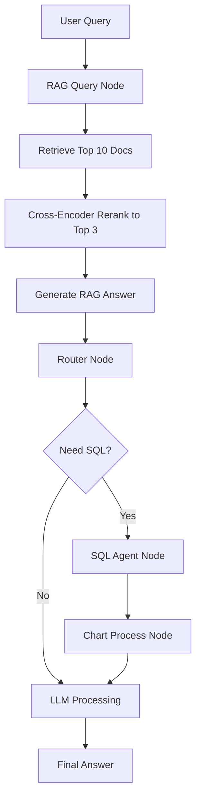

# Smart AI Assistant - Frontend

> An intelligent data analysis platform powered by LangGraph + Natural Language Processing

## 🎯 Project Overview

Smart AI Assistant is a modern React-based frontend application that provides intelligent data analysis capabilities through natural language processing. Built with LangGraph workflow engine integration, it offers comprehensive data source management, real-time analysis visualization, detailed execution logs, and multi-language support.

### Core Features

- 🧠 **Intelligent Analysis**: LangGraph-powered workflow engine for complex data processing
- 📊 **Data Source Management**: Support for multiple data source types (Knowledge Base, SQL Tables, Hybrid)
- 🌐 **Multi-language Support**: Full internationalization with English and Chinese
- ⚡ **Real-time Processing**: WebSocket-based live workflow execution monitoring
- 📝 **Execution Logs**: Detailed real-time display of node reasoning, document retrieval, SQL queries, and data processing
- 📈 **Data Visualization**: Interactive charts and reports generation
- 🔍 **Node Inspection**: Detailed workflow node execution analysis
- 🎨 **Modern UI**: Responsive design with dark/light theme support

## 🛠️ Tech Stack

### Frontend Technologies
- **React 18** - Modern UI framework with hooks
- **Redux Toolkit** - State management with RTK Query
- **Tailwind CSS** - Utility-first CSS framework
- **Radix UI** - Accessible component primitives
- **React Router 6** - Client-side routing
- **i18next** - Internationalization framework
- **Recharts** - Data visualization library
- **Vite** - Next-generation build tool
- **Lucide React** - Beautiful icon library

### Key Dependencies
```json
{
  "react": "^18.2.0",
  "react-redux": "^9.2.0", 
  "@reduxjs/toolkit": "^2.8.2",
  "react-i18next": "^15.5.2",
  "tailwindcss": "^3.4.17",
  "@radix-ui/react-dialog": "^1.1.14",
  "recharts": "^2.15.3",
  "vite": "^5.0.0"
}
```

## 🚀 Quick Start

### Prerequisites
- Node.js 16+ 
- npm or yarn package manager

### Installation

```bash
# Install dependencies
npm install

# Start development server
npm run dev

# Build for production
npm run build

# Preview production build
npm run preview

# Lint code
npm run lint
```

The application will start at `http://localhost:3000` (or the port shown in terminal)

## 📁 Project Structure

```
src/
├── components/              # React components
│   ├── IntelligentAnalysis.jsx   # LangGraph workflow analysis with execution logs
│   ├── DataSourceManager.jsx     # Data source management
│   ├── QueryForm.jsx            # Natural language query interface  
│   ├── Header.jsx               # Navigation header
│   ├── Dashboard.jsx            # Main dashboard
│   ├── ChartDisplay.jsx         # Data visualization
│   ├── ReportGenerator.jsx      # Report generation
│   ├── InventoryCheck.jsx       # Inventory management
│   └── ui/                      # Reusable UI components
│       ├── dialog.tsx           # Modal dialogs
│       ├── button.tsx           # Button components
│       ├── card.tsx             # Card layout
│       └── ...                  # Other UI primitives
├── hooks/                   # Custom React hooks
│   └── useWorkflowWebSocket.js  # WebSocket connection management
├── store/                   # Redux store configuration
│   ├── index.js            # Store setup
│   └── slices/
│       └── workflowSlice.js    # Workflow state management
├── services/               # API services
│   └── api.js             # HTTP client configuration
├── locales/               # Internationalization
│   ├── en/                # English translations
│   └── zh/                # Chinese translations
├── lib/                   # Utility libraries
├── App.jsx               # Main application component
└── main.jsx              # Application entry point
```

## 🔧 Configuration

### Environment Variables

Create `.env.local` file for local development:

```env
# Backend API URL
VITE_API_URL=http://localhost:8000

# Development mode
VITE_DEV_MODE=true

# WebSocket URL (optional, defaults to same host)
VITE_WS_URL=ws://localhost:8000
```

**Note**: Vite environment variables must be prefixed with `VITE_` to be accessible in the browser.

### Proxy Configuration

Development server proxy is configured in `vite.config.js`:

```javascript
export default defineConfig({
  server: {
    proxy: {
      '/api': 'http://127.0.0.1:8000',
      '/ws': {
        target: 'ws://127.0.0.1:8000',
        ws: true,
      },
    }
  }
})
```

## 🎨 Feature Overview

### 1. Intelligent Analysis Engine
- **LangGraph Integration**: Sophisticated workflow processing engine with 5 core nodes
- **Real-time Monitoring**: Live execution tracking with WebSocket
- **Node Inspection**: Detailed analysis of each workflow step
- **Visual Flow Diagram**: Interactive workflow visualization
- **Execution Logs**: Real-time scrolling log display showing:
  - Document retrieval details (Top 10 → reranked to Top 3)
  - Document sources with file paths and similarity scores
  - SQL query execution with table names and results
  - Chart generation process and data points
  - Node reasoning and decision-making processes

### 2. LangGraph Workflow Nodes

The system implements a sophisticated LangGraph workflow with the following nodes:

- **RAG Query Node**: 
  - Retrieves Top 10 documents from knowledge base
  - Uses Cross-Encoder to rerank to Top 3 documents
  - Generates answer based on reranked documents
  - Shows document sources, scores, and content previews

- **Router Node**: 
  - Analyzes query and RAG answer
  - Decides whether SQL-Agent is needed
  - Shows routing decision reasoning

- **SQL Agent Node**: 
  - ReAct-based SQL exploration
  - Tracks intermediate steps (tool calls, observations)
  - Shows executed SQL queries with table names
  - Displays query results (row count, columns, sample data)

- **Chart Process Node**: 
  - Analyzes if data is suitable for visualization
  - Automatically selects chart type
  - Shows chart configuration and data points

- **LLM Processing Node**: 
  - Integrates RAG, SQL, and Chart inputs
  - Generates final natural language answer
  - Shows streaming answer generation

### 3. Execution Log Display

The execution log provides detailed real-time information:

- **Color-coded Log Types**: Success (green), Error (red), Running (yellow), Reasoning (blue), Info (gray)
- **Auto-scrolling**: Automatically scrolls to latest log entries
- **Detailed Information**:
  - Document retrieval: File names, paths, similarity scores, content previews
  - Reranking: Cross-Encoder scores, top documents
  - SQL queries: Full SQL text, table names, result summaries
  - Chart data: Data points, chart type, configuration
  - Node reasoning: Decision-making processes and explanations

### 4. Data Source Management
- **Multiple Types**: Knowledge Base (RAG), SQL Tables, Hybrid sources
- **File Upload**: Support for CSV, PDF, TXT, Word documents
- **Real-time Processing**: Live file processing status updates
- **Source Switching**: Dynamic data source activation

### 5. Multi-language Support
- **Complete i18n**: Full interface translation
- **Language Detection**: Automatic browser language detection
- **RTL Support**: Ready for right-to-left languages
- **Dynamic Switching**: Real-time language switching

### 6. Modern UI/UX
- **Responsive Design**: Mobile-first approach
- **Dark/Light Theme**: System preference detection
- **Accessibility**: WCAG compliant components
- **Smooth Animations**: Tailwind CSS animations

## 🔄 Workflow Architecture

### LangGraph Node Flow

```
Start → RAG Query → Router → [SQL Agent] → Chart Process → LLM Processing → End
                              ↓
                          (Optional)
```

### State Management
- **Redux Toolkit**: Centralized state management
- **WebSocket Integration**: Real-time state updates
- **Persistent Storage**: Execution history and preferences
- **Optimistic Updates**: Immediate UI feedback

## 📊 Data Flow



## 🧪 Development Guide

### Component Development
```jsx
// Example component structure
import React from 'react';
import { useTranslation } from 'react-i18next';
import { useSelector, useDispatch } from 'react-redux';

export default function MyComponent() {
  const { t } = useTranslation();
  const dispatch = useDispatch();
  
  return (
    <div className="p-4">
      <h1>{t('myComponent.title')}</h1>
      {/* Component content */}
    </div>
  );
}
```

### Adding Translations
```javascript
// locales/en/translation.json
{
  "myComponent": {
    "title": "My Component Title",
    "description": "Component description"
  }
}
```

### WebSocket Integration
```javascript
// hooks/useWorkflowWebSocket.js
import { useEffect } from 'react';
import { useDispatch } from 'react-redux';
import { updateWorkflowState } from '../store/slices/workflowSlice';

export const useWorkflowWebSocket = (clientId) => {
  const dispatch = useDispatch();
  
  useEffect(() => {
    const ws = new WebSocket(`ws://localhost:8000/ws/workflow/${clientId}`);
    
    ws.onmessage = (event) => {
      const data = JSON.parse(event.data);
      dispatch(updateWorkflowState(data));
    };
    
    return () => ws.close();
  }, [clientId, dispatch]);
};
```

## 🚦 API Integration

### REST Endpoints
- `GET /api/v1/datasources` - List data sources
- `POST /api/v1/datasources` - Create data source
- `POST /api/v1/intelligent-analysis` - Start analysis
- `GET /api/v1/files` - List files

### WebSocket Events
- `workflow.execution.started` - Workflow begins
- `workflow.node.started` - Node execution starts
- `workflow.node.completed` - Node execution completes
- `workflow.node.error` - Node execution error
- `workflow.execution.completed` - Workflow finishes
- `workflow.token_stream` - Streaming answer generation

### WebSocket Message Format
```javascript
{
  "type": "workflow.node.completed",
  "execution_id": "uuid",
  "node_id": "rag_query_node",
  "timestamp": 1234567890,
  "data": {
    "status": "completed",
    "duration": 2.5,
    "output": {
      "retrieved_documents": [...],
      "reranked_documents": [...],
      "rag_answer": "..."
    }
  }
}
```

## 🎯 Usage Examples

### Natural Language Queries
```
"What are the sales figures for this month?"
"Show me products with low inventory"
"Generate a sales trend chart for 2025"
"Who is the top-performing sales representative?"
"What does our policy document say about returns?"
```

### Supported File Types
- **CSV/Excel**: For structured data analysis
- **PDF/Word**: For document-based RAG queries (Top 10 retrieval → Top 3 reranking)
- **TXT**: For text-based knowledge base

## 🎨 UI Components

### Custom Components
- **Dialog System**: Modal dialogs with accessibility
- **Data Tables**: Sortable, filterable data displays  
- **Chart Components**: Interactive data visualizations
- **Form Controls**: Consistent input components
- **Loading States**: Skeleton screens and spinners
- **Execution Log Display**: Real-time scrolling log with color-coded entries

### Styling Approach
- **Tailwind CSS**: Utility-first styling
- **Component Variants**: Consistent design system
- **Responsive Breakpoints**: Mobile-first design
- **Dark Mode**: System preference support

## 🚧 Development Roadmap

### Current Features ✅
- ✅ LangGraph workflow integration (5-node architecture)
- ✅ Multi-data source management
- ✅ Real-time WebSocket monitoring
- ✅ Detailed execution logs with node reasoning
- ✅ Complete internationalization
- ✅ Node execution details
- ✅ Responsive UI/UX
- ✅ RAG retrieval (Top 10 → Top 3 reranking)
- ✅ SQL Agent with ReAct pattern
- ✅ Automatic chart generation

### Upcoming Features 🔄
- 🔄 Advanced chart customization
- 🔄 Export/import workflows
- 🔄 User authentication system
- 🔄 Advanced filtering options
- 🔄 Performance optimization
- 🔄 Mobile app (React Native)

## 🧪 Testing

### Manual Testing
```bash
# Start development server
npm run dev

# Test workflow execution
1. Navigate to Intelligent Analysis
2. Select a data source
3. Enter natural language query
4. Monitor workflow execution in real-time
5. View execution logs showing:
   - Document retrieval (Top 10 docs)
   - Reranking results (Top 3 docs)
   - SQL query execution
   - Chart generation process
   - Node reasoning details
6. Click nodes to view detailed information

# Test internationalization
1. Switch language in header
2. Verify all text updates
3. Test RTL languages (future)
```

### Development Tools
- **React DevTools**: Component inspection
- **Redux DevTools**: State debugging
- **Vite DevTools**: Build analysis
- **i18n Ally**: Translation management

## 🤝 Contributing

### Development Setup
1. Fork the repository
2. Clone your fork: `git clone <your-fork>`
3. Install dependencies: `npm install`
4. Create feature branch: `git checkout -b feature/amazing-feature`
5. Make changes and test
6. Commit changes: `git commit -m 'Add amazing feature'`
7. Push to branch: `git push origin feature/amazing-feature`
8. Open Pull Request

### Code Standards
- **ESLint**: Code quality enforcement
- **Prettier**: Code formatting
- **TypeScript**: Type safety (gradual migration)
- **Conventional Commits**: Commit message format

### Translation Contributions
- Add new language files in `src/locales/`
- Follow existing translation key structure
- Test language switching functionality
- Update README with new language support

## 📄 License

This project is licensed under the MIT License - see the [LICENSE](../LICENSE) file for details.

## 🌟 Acknowledgments

- **LangChain Team**: For the powerful AI framework
- **Radix UI**: For accessible component primitives  
- **Tailwind CSS**: For the utility-first CSS framework
- **React Team**: For the amazing React framework
- **Vite Team**: For the lightning-fast build tool

---

⭐ **If this project helps you, please give it a star!** 

🔗 **Links**
- [Backend API Documentation](../server/README.md)
- [Project Root Documentation](../README.md)
