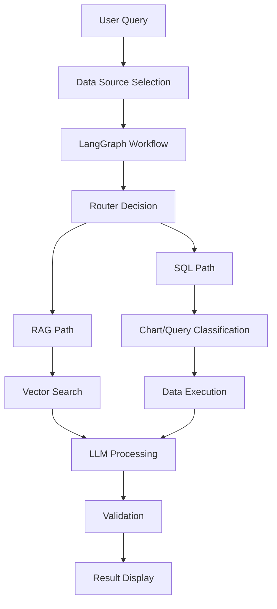

# Smart AI Assistant - Frontend

> An intelligent data analysis platform powered by LangChain + Natural Language Processing

## 🎯 Project Overview

Smart AI Assistant is a modern React-based frontend application that provides intelligent data analysis capabilities through natural language processing. Built with LangGraph workflow engine integration, it offers comprehensive data source management, real-time analysis visualization, and multi-language support.

### Core Features

- 🧠 **Intelligent Analysis**: LangGraph-powered workflow engine for complex data processing
- 📊 **Data Source Management**: Support for multiple data source types (Knowledge Base, SQL Tables, Hybrid)
- 🌐 **Multi-language Support**: Full internationalization with English and Chinese
- ⚡ **Real-time Processing**: WebSocket-based live workflow execution monitoring
- 📈 **Data Visualization**: Interactive charts and reports generation
- 🔍 **Node Inspection**: Detailed workflow node execution analysis
- 🎨 **Modern UI**: Responsive design with dark/light theme support

## 🛠️ Tech Stack

### Frontend Technologies
- **React 18** - Modern UI framework with hooks
- **Redux Toolkit** - State management with RTK Query
- **Tailwind CSS** - Utility-first CSS framework
- **Radix UI** - Accessible component primitives
- **React Router 6** - Client-side routing
- **i18next** - Internationalization framework
- **Recharts** - Data visualization library
- **Vite** - Next-generation build tool
- **Lucide React** - Beautiful icon library

### Key Dependencies
```json
{
  "react": "^18.2.0",
  "react-redux": "^9.2.0", 
  "@reduxjs/toolkit": "^2.8.2",
  "react-i18next": "^15.5.2",
  "tailwindcss": "^3.4.17",
  "@radix-ui/react-dialog": "^1.1.14",
  "recharts": "^2.15.3",
  "vite": "^5.0.0"
}
```

## 🚀 Quick Start

### Prerequisites
- Node.js 16+ 
- npm or yarn package manager

### Installation

```bash
# Install dependencies
npm install

# Start development server
npm run dev

# Build for production
npm run build

# Preview production build
npm run preview

# Lint code
npm run lint
```

The application will start at `http://localhost:3000` (or the port shown in terminal)

## 📁 Project Structure

```
src/
├── components/              # React components
│   ├── IntelligentAnalysis.jsx   # LangGraph workflow analysis
│   ├── DataSourceManager.jsx     # Data source management
│   ├── QueryForm.jsx            # Natural language query interface  
│   ├── Header.jsx               # Navigation header
│   ├── Dashboard.jsx            # Main dashboard
│   ├── ChartDisplay.jsx         # Data visualization
│   ├── ReportGenerator.jsx      # Report generation
│   ├── InventoryCheck.jsx       # Inventory management
│   └── ui/                      # Reusable UI components
│       ├── dialog.tsx           # Modal dialogs
│       ├── button.tsx           # Button components
│       ├── card.tsx             # Card layout
│       └── ...                  # Other UI primitives
├── hooks/                   # Custom React hooks
│   └── useWorkflowWebSocket.js  # WebSocket connection management
├── store/                   # Redux store configuration
│   ├── index.js            # Store setup
│   └── workflowSlice.js    # Workflow state management
├── services/               # API services
│   └── api.js             # HTTP client configuration
├── locales/               # Internationalization
│   ├── en/                # English translations
│   └── zh/                # Chinese translations
├── lib/                   # Utility libraries
├── App.jsx               # Main application component
└── main.jsx              # Application entry point
```

## 🔧 Configuration

### Environment Variables

Create `.env.local` file for local development:

```env
# Backend API URL
VITE_API_URL=http://localhost:8000

# Development mode
VITE_DEV_MODE=true

# WebSocket URL (optional, defaults to same host)
VITE_WS_URL=ws://localhost:8000
```

**Note**: Vite environment variables must be prefixed with `VITE_` to be accessible in the browser.

### Proxy Configuration

Development server proxy is configured in `vite.config.js`:

```javascript
export default defineConfig({
  server: {
    proxy: {
      '/api': 'http://127.0.0.1:8000',
      '/ws': {
        target: 'ws://127.0.0.1:8000',
        ws: true,
      },
    }
  }
})
```

## 🎨 Feature Overview

### 1. Intelligent Analysis Engine
- **LangGraph Integration**: Sophisticated workflow processing engine
- **Real-time Monitoring**: Live execution tracking with WebSocket
- **Node Inspection**: Detailed analysis of each workflow step
- **Visual Flow Diagram**: Interactive workflow visualization

### 2. Data Source Management
- **Multiple Types**: Knowledge Base (RAG), SQL Tables, Hybrid sources
- **File Upload**: Support for CSV, PDF, TXT, Word documents
- **Real-time Processing**: Live file processing status updates
- **Source Switching**: Dynamic data source activation

### 3. Multi-language Support
- **Complete i18n**: Full interface translation
- **Language Detection**: Automatic browser language detection
- **RTL Support**: Ready for right-to-left languages
- **Dynamic Switching**: Real-time language switching

### 4. Modern UI/UX
- **Responsive Design**: Mobile-first approach
- **Dark/Light Theme**: System preference detection
- **Accessibility**: WCAG compliant components
- **Smooth Animations**: Tailwind CSS animations

## 🔄 Workflow Architecture

### LangGraph Node Types
1. **Router Node**: Determines processing path (SQL vs RAG)
2. **Classifier Node**: Categorizes query type (query vs chart)
3. **Execution Nodes**: Process SQL queries or RAG searches
4. **LLM Processing**: Natural language response generation
5. **Validation Node**: Quality score assessment
6. **Retry Node**: Error recovery and improvement

### State Management
- **Redux Toolkit**: Centralized state management
- **WebSocket Integration**: Real-time state updates
- **Persistent Storage**: Execution history and preferences
- **Optimistic Updates**: Immediate UI feedback

## 📊 Data Flow



## 🧪 Development Guide

### Component Development
```jsx
// Example component structure
import React from 'react';
import { useTranslation } from 'react-i18next';
import { useSelector, useDispatch } from 'react-redux';

export default function MyComponent() {
  const { t } = useTranslation();
  const dispatch = useDispatch();
  
  return (
    <div className="p-4">
      <h1>{t('myComponent.title')}</h1>
      {/* Component content */}
    </div>
  );
}
```

### Adding Translations
```javascript
// locales/en/translation.json
{
  "myComponent": {
    "title": "My Component Title",
    "description": "Component description"
  }
}
```

### WebSocket Integration
```javascript
// hooks/useWebSocket.js
import { useEffect } from 'react';
import { useDispatch } from 'react-redux';

export const useWebSocket = () => {
  const dispatch = useDispatch();
  
  useEffect(() => {
    // WebSocket connection logic
  }, []);
};
```

## 🚦 API Integration

### REST Endpoints
- `GET /api/v1/datasources` - List data sources
- `POST /api/v1/datasources` - Create data source
- `POST /api/v1/intelligent-analysis` - Start analysis
- `GET /api/v1/files` - List files

### WebSocket Events
- `workflow.execution.started` - Workflow begins
- `workflow.node.started` - Node execution starts
- `workflow.node.completed` - Node execution completes
- `workflow.execution.completed` - Workflow finishes

## 🎯 Usage Examples

### Natural Language Queries
```
"What are the sales figures for this month?"
"Show me products with low inventory"
"Generate a sales trend chart for 2025"
"Who is the top-performing sales representative?"
```

### Supported File Types
- **CSV/Excel**: For structured data analysis
- **PDF/Word**: For document-based RAG queries
- **TXT**: For text-based knowledge base

## 🎨 UI Components

### Custom Components
- **Dialog System**: Modal dialogs with accessibility
- **Data Tables**: Sortable, filterable data displays  
- **Chart Components**: Interactive data visualizations
- **Form Controls**: Consistent input components
- **Loading States**: Skeleton screens and spinners

### Styling Approach
- **Tailwind CSS**: Utility-first styling
- **Component Variants**: Consistent design system
- **Responsive Breakpoints**: Mobile-first design
- **Dark Mode**: System preference support

## 🚧 Development Roadmap

### Current Features ✅
- ✅ LangGraph workflow integration
- ✅ Multi-data source management
- ✅ Real-time WebSocket monitoring
- ✅ Complete internationalization
- ✅ Node execution details
- ✅ Responsive UI/UX

### Upcoming Features 🔄
- 🔄 Advanced chart customization
- 🔄 Export/import workflows
- 🔄 User authentication system
- 🔄 Advanced filtering options
- 🔄 Performance optimization
- 🔄 Mobile app (React Native)

## 🧪 Testing

### Manual Testing
```bash
# Start development server
npm run dev

# Test workflow execution
1. Navigate to Intelligent Analysis
2. Select a data source
3. Enter natural language query
4. Monitor workflow execution
5. Click nodes to view details

# Test internationalization
1. Switch language in header
2. Verify all text updates
3. Test RTL languages (future)
```

### Development Tools
- **React DevTools**: Component inspection
- **Redux DevTools**: State debugging
- **Vite DevTools**: Build analysis
- **i18n Ally**: Translation management

## 🤝 Contributing

### Development Setup
1. Fork the repository
2. Clone your fork: `git clone <your-fork>`
3. Install dependencies: `npm install`
4. Create feature branch: `git checkout -b feature/amazing-feature`
5. Make changes and test
6. Commit changes: `git commit -m 'Add amazing feature'`
7. Push to branch: `git push origin feature/amazing-feature`
8. Open Pull Request

### Code Standards
- **ESLint**: Code quality enforcement
- **Prettier**: Code formatting
- **TypeScript**: Type safety (gradual migration)
- **Conventional Commits**: Commit message format

### Translation Contributions
- Add new language files in `src/locales/`
- Follow existing translation key structure
- Test language switching functionality
- Update README with new language support

## 📄 License

This project is licensed under the MIT License - see the [LICENSE](../LICENSE) file for details.

## 🌟 Acknowledgments

- **LangChain Team**: For the powerful AI framework
- **Radix UI**: For accessible component primitives  
- **Tailwind CSS**: For the utility-first CSS framework
- **React Team**: For the amazing React framework
- **Vite Team**: For the lightning-fast build tool

---

⭐ **If this project helps you, please give it a star!** 

🔗 **Links**
- [Backend API Documentation](../server/README.md)
- [Project Root Documentation](../README.md)
