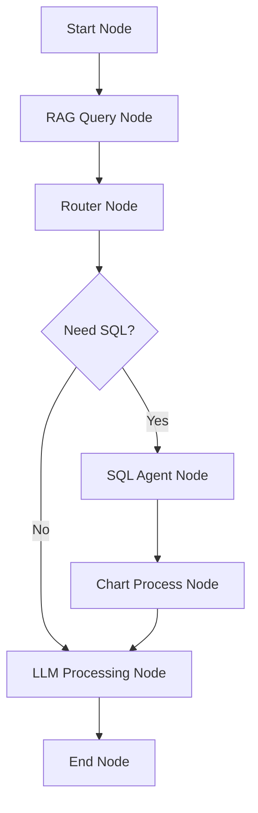

# Smart AI Assistant - Backend

> Enterprise-grade AI-powered data analysis platform built with FastAPI, LangGraph, and multi-LLM support

## 🎯 Overview

Smart AI Assistant Backend is a sophisticated Python-based API service that provides intelligent data analysis capabilities through natural language processing. Built on modern technologies including LangGraph workflow orchestration, multi-provider LLM support, Cross-Encoder document reranking, and real-time WebSocket communication, it offers comprehensive data source management and advanced AI-driven insights.

## ✨ Key Features

### 🧠 Advanced AI Processing
- **LangGraph Workflow Engine**: Sophisticated multi-step AI processing pipelines with 5 core nodes
- **Multi-LLM Support**: OpenAI, OpenRouter, and Ollama integration
- **RAG Retrieval**: Top 10 document retrieval → Cross-Encoder reranking → Top 3 documents
- **Intelligent Routing**: SQL vs RAG path determination based on query analysis
- **SQL Agent**: ReAct-based SQL exploration with intermediate step tracking
- **Chart Generation**: Automatic chart type selection and data visualization
- **Quality Validation**: Automated output quality scoring and retry mechanisms

### 📊 Data Source Management
- **Multiple Data Types**: Knowledge Base (RAG), SQL Tables, and Hybrid sources
- **File Processing**: Support for CSV, PDF, TXT, Word, Excel documents
- **Vector Storage**: FAISS-based document embeddings and similarity search
- **Document Reranking**: Cross-Encoder (ms-marco-MiniLM-L-6-v2) for improved retrieval quality
- **Real-time Processing**: Live file processing status updates

### ⚡ Real-time Features
- **WebSocket Integration**: Live workflow execution monitoring
- **Node-level Tracking**: Detailed step-by-step process visualization
- **Execution Logs**: Comprehensive logging of node reasoning, document sources, SQL queries, and data processing
- **Event Broadcasting**: Real-time status updates to connected clients
- **Execution History**: Complete audit trail of all processing activities

### 🌐 Enterprise Architecture
- **REST API**: Comprehensive RESTful endpoints
- **Configuration Management**: Environment-based multi-tier configuration
- **Error Handling**: Robust error recovery and reporting
- **Scalable Design**: Modular architecture for easy extension

## 🛠️ Technology Stack

### Core Framework
- **FastAPI** - High-performance async web framework
- **Pydantic** - Data validation and serialization
- **SQLAlchemy** - Database ORM and management
- **Uvicorn** - ASGI server for production deployment

### AI & Machine Learning
- **LangChain** - AI application framework
- **LangGraph** - Workflow orchestration engine
- **Transformers** - HuggingFace model integration
- **Sentence Transformers** - Local embedding models
- **Cross-Encoder** - Document reranking (ms-marco-MiniLM-L-6-v2)
- **FAISS** - Vector similarity search
- **PyTorch** - Deep learning backend

### Data Processing
- **Pandas** - Data manipulation and analysis
- **OpenPyXL** - Excel file processing
- **PyPDF2** - PDF document parsing
- **python-docx** - Word document processing
- **SQLite/PostgreSQL** - Relational database support

### Real-time Communication
- **WebSockets** - Real-time bidirectional communication
- **AsyncIO** - Asynchronous programming support
- **Event Broadcasting** - Multi-client message distribution

## 📁 Project Architecture

```
server/
├── src/                        # Core application package
│   ├── agents/                # AI agent implementations
│   │   ├── __init__.py
│   │   └── intelligent_agent.py  # Core AI agent with RAG retrieval (Top 10 → Top 3)
│   ├── api/                   # API endpoints and routes
│   │   ├── __init__.py
│   │   └── routes.py          # FastAPI route definitions and handlers
│   ├── chains/                # LangChain workflow definitions
│   │   ├── __init__.py
│   │   ├── langgraph_flow.py  # Main LangGraph workflow (5-node architecture)
│   │   └── ...                # Other workflow implementations
│   ├── components/            # Reusable components
│   │   └── __init__.py
│   ├── config/               # Configuration management
│   │   ├── __init__.py
│   │   └── config.py         # Environment and application configuration
│   ├── database/            # Database operations
│   │   ├── __init__.py
│   │   └── db_operations.py  # SQLite database operations and queries
│   ├── document_loaders/    # File processing and loading
│   │   ├── __init__.py
│   │   └── file_processor.py # Multi-format file processing (CSV, PDF, etc.)
│   ├── models/             # Data models and factories
│   │   ├── __init__.py
│   │   ├── data_models.py         # Pydantic data models and enums
│   │   ├── embedding_factory.py   # Embedding model provider factory
│   │   ├── llm_factory.py        # LLM provider factory (OpenAI, Ollama, etc.)
│   │   ├── reranker.py           # Cross-Encoder reranking implementation
│   │   └── openrouter_models.py  # OpenRouter model configurations
│   ├── prompts/            # LLM prompts and templates
│   │   └── __init__.py
│   ├── utils/             # Utility functions
│   │   ├── __init__.py
│   │   └── common_utils.py  # Shared utility functions
│   ├── vectorstores/      # Vector storage implementations
│   │   └── __init__.py
│   ├── websocket/         # WebSocket management
│   │   ├── __init__.py
│   │   └── websocket_manager.py  # Real-time connection management
│   ├── __init__.py
│   └── main.py           # FastAPI application entry point
├── data/                 # Data storage directory
│   ├── embeddings_cache/ # Embedding model cache for faster processing
│   ├── reports/         # Generated analysis reports and exports
│   ├── resume/          # Resume file storage for processing
│   ├── sample_sales/    # Sample data for testing and demos
│   ├── uploads/         # Temporary storage for uploaded files
│   └── smart.db        # SQLite database for structured data
├── requirements.txt     # Python package dependencies
├── start.py            # Application launcher with environment setup
├── env.example         # Environment configuration template
├── env.local.example   # Local environment configuration template
└── vercel.json         # Vercel deployment configuration
```

## 🚀 Quick Start

### Prerequisites

- **Python 3.8+** with pip package manager
- **Node.js 16+** (for frontend development)
- **SQLite** (included with Python)
- **Git** for version control

### Installation

1. **Clone the repository**
```bash
git clone <repository-url>
cd smart-ai-assistant/server
```

2. **Create virtual environment**
```bash
python -m venv venv

# Activate virtual environment
# Windows:
venv\Scripts\activate
# Linux/macOS:
source venv/bin/activate
```

3. **Install dependencies**
```bash
pip install -r requirements.txt
```

4. **Environment configuration**
```bash
cp env.example .env
# Edit .env file with your configuration
```

5. **Initialize the application**
```bash
python start.py
```

The API will be available at `http://localhost:8000`

### Environment Configuration

Create a `.env` file based on `env.example`:

```env
# Server Configuration
HOST=0.0.0.0
PORT=8000
DEBUG=True

# LLM Provider Configuration
LLM_PROVIDER=openai          # openai, openrouter, ollama
LLM_MODEL=gpt-3.5-turbo
LLM_TEMPERATURE=0.0
LLM_MAX_TOKENS=2048

# API Keys
OPENAI_API_KEY=your_openai_api_key_here
OPENROUTER_API_KEY=your_openrouter_api_key_here

# Embedding Configuration
EMBEDDING_PROVIDER=local     # local, openai, huggingface, ollama
EMBEDDING_MODEL=intfloat/multilingual-e5-small

# Database Configuration
DATABASE_URL=sqlite:///./data/smart.db

# Logging
LOG_LEVEL=INFO
```

## 🔧 Configuration Options

### LLM Provider Support

The system supports multiple LLM providers with unified configuration:

#### OpenAI
```env
LLM_PROVIDER=openai
LLM_MODEL=gpt-3.5-turbo
OPENAI_API_KEY=your_api_key
```

#### OpenRouter
```env
LLM_PROVIDER=openrouter
LLM_MODEL=anthropic/claude-3-haiku
OPENROUTER_API_KEY=your_api_key
```

#### Ollama (Local)
```env
LLM_PROVIDER=ollama
LLM_MODEL=llama2
OLLAMA_BASE_URL=http://localhost:11434
```

### Embedding Models

Choose from multiple embedding providers:

- **Local**: `intfloat/multilingual-e5-small` (default)
- **OpenAI**: `text-embedding-3-small`
- **HuggingFace**: Various transformer models
- **Ollama**: Local model deployment

### Document Reranking

The system uses Cross-Encoder for document reranking:

- **Model**: `cross-encoder/ms-marco-MiniLM-L-6-v2`
- **Retrieval Strategy**: Top 10 documents → Cross-Encoder reranking → Top 3 documents
- **Benefits**: Improved relevance and accuracy of retrieved documents

## 🌊 LangGraph Workflow Engine

### Workflow Architecture

The system uses LangGraph to orchestrate a 5-node AI processing workflow:



### Node Types

1. **RAG Query Node**:
   - Retrieves Top 10 documents from knowledge base using FAISS
   - Uses Cross-Encoder to rerank to Top 3 documents
   - Generates answer based on reranked documents
   - Records document sources, similarity scores, and content previews

2. **Router Node**:
   - Analyzes user query and RAG answer
   - Decides whether SQL-Agent is needed
   - Provides routing decision reasoning
   - Routes to SQL-Agent path or LLM Processing path

3. **SQL Agent Node**:
   - ReAct-based SQL exploration
   - Tracks intermediate steps (tool calls, observations)
   - Generates and executes SQL queries
   - Records SQL queries, table names, and query results

4. **Chart Process Node**:
   - Analyzes if structured data is suitable for visualization
   - Automatically selects appropriate chart type
   - Generates chart configuration and data points
   - Records chart generation decision and data analysis

5. **LLM Processing Node**:
   - Integrates RAG answer, SQL results, and chart information
   - Generates final natural language answer
   - Supports streaming output
   - Records integration process and answer generation

### Workflow Tracking

- **Real-time Monitoring**: Live execution tracking via WebSocket
- **Node-level Details**: Input/output inspection for each step
- **Execution Logs**: Detailed logging of:
  - Document retrieval (Top 10 → Top 3)
  - SQL query execution with table names
  - Chart generation process
  - Node reasoning and decision-making
- **Performance Metrics**: Execution time and resource usage
- **Error Recovery**: Automatic retry with improved parameters

## 🔌 API Reference

### Core Endpoints

#### Data Source Management
```http
GET    /api/v1/datasources              # List all data sources
POST   /api/v1/datasources              # Create new data source
PUT    /api/v1/datasources/{id}/activate # Activate data source
DELETE /api/v1/datasources/{id}         # Delete data source
```

#### File Management
```http
GET    /api/v1/datasources/{id}/files   # List files in data source
POST   /api/v1/datasources/{id}/upload  # Upload file to data source
DELETE /api/v1/files/{file_id}          # Delete specific file
```

#### Intelligent Analysis
```http
POST   /api/v1/intelligent-analysis     # Start LangGraph workflow
GET    /api/v1/executions/{id}          # Get execution details
GET    /api/v1/executions               # List execution history
```

#### System Information
```http
GET    /api/v1/health                   # Health check
GET    /api/v1/info                     # System information
GET    /api/v1/models                   # Available models
```

### WebSocket Events

Connect to `/ws/workflow/{client_id}` for real-time updates:

```javascript
// Event types
{
  "type": "workflow.execution.started",
  "execution_id": "uuid",
  "timestamp": 1234567890,
  "data": {...}
}

{
  "type": "workflow.node.started",
  "execution_id": "uuid", 
  "node_id": "rag_query_node",
  "timestamp": 1234567890,
  "data": {
    "input": {...}
  }
}

{
  "type": "workflow.node.completed",
  "execution_id": "uuid",
  "node_id": "rag_query_node", 
  "duration": 2.5,
  "data": {
    "output": {
      "retrieved_documents": [...],  // Top 10 documents
      "reranked_documents": [...],    // Top 3 documents
      "rag_answer": "...",
      "retrieval_success": true,
      "rerank_success": true,
      "rag_success": true
    }
  }
}

{
  "type": "workflow.token_stream",
  "execution_id": "uuid",
  "node_id": "llm_processing_node",
  "token": "generated",
  "text": "partial answer..."
}
```

## 📊 Data Processing Capabilities

### Supported File Types

#### Structured Data
- **CSV Files**: Automatic SQL table creation and querying
- **Excel Files**: Multi-sheet processing with data type inference
- **JSON Files**: Nested data structure handling

#### Unstructured Data
- **PDF Documents**: Text extraction and vector embeddings
- **Word Documents**: Content parsing and knowledge base integration
- **Text Files**: Direct content vectorization

### Data Source Types

1. **Knowledge Base (RAG)**
   - Document-based question answering
   - Vector similarity search (FAISS)
   - Top 10 retrieval → Cross-Encoder reranking → Top 3
   - Multi-document reasoning

2. **SQL Tables**
   - Natural language to SQL conversion
   - Automated chart generation
   - Data aggregation and analysis
   - ReAct-based SQL exploration

3. **Hybrid Sources**
   - Combined structured and unstructured data
   - Intelligent routing between SQL and RAG
   - Cross-source data correlation

## 🎯 Usage Examples

### Natural Language Queries

```python
# Sales Analysis
"What were the total sales for this month?"
"Show me the top 5 products by revenue"
"Generate a sales trend chart for 2024"

# Inventory Management  
"Which products are running low on stock?"
"Show me products with less than 50 units"

# Document Questions (RAG)
"What does our policy say about returns?"
"Who is responsible for data security?"
```

### API Usage Examples

#### Start Intelligent Analysis
```bash
curl -X POST "http://localhost:8000/api/v1/intelligent-analysis" \
  -H "Content-Type: application/json" \
  -d '{
    "query": "What are the sales figures for this month?",
    "datasource_id": 1,
    "client_id": "client-123"
  }'
```

#### Upload File to Data Source
```bash
curl -X POST "http://localhost:8000/api/v1/datasources/1/upload" \
  -F "file=@sales_data.csv" \
  -F "description=Monthly sales data"
```

#### WebSocket Connection
```javascript
const ws = new WebSocket('ws://localhost:8000/ws/workflow/client-123');

ws.onmessage = (event) => {
  const data = JSON.parse(event.data);
  console.log('Workflow update:', data);
  // Handle different event types:
  // - workflow.execution.started
  // - workflow.node.started
  // - workflow.node.completed
  // - workflow.token_stream
  // - workflow.execution.completed
};
```

## 🔍 Development Guide

### Adding New Workflow Nodes

1. **Define Node Function**
```python
async def custom_node(state: GraphState) -> GraphState:
    """Custom processing node"""
    # Your processing logic here
    # Send WebSocket events for real-time updates
    await send_websocket_event(
        execution_id=state["execution_id"],
        event_type="workflow.node.started",
        node_id="custom_node",
        data={"input": state}
    )
    
    # Process...
    result = process_data(state)
    
    await send_websocket_event(
        execution_id=state["execution_id"],
        event_type="workflow.node.completed",
        node_id="custom_node",
        data={"output": result}
    )
    
    return {**state, "custom_output": result}
```

2. **Register in Workflow**
```python
workflow.add_node("custom_node", custom_node)
workflow.add_edge("previous_node", "custom_node")
```

### RAG Retrieval Configuration

The RAG retrieval process uses a two-stage approach:

1. **Initial Retrieval**: Top 10 documents using FAISS similarity search
2. **Reranking**: Cross-Encoder reranking to Top 3 documents

```python
# In intelligent_agent.py
retrieval_result = await perform_rag_retrieval(
    query=user_input,
    datasource=datasource,
    k=10  # Retrieve Top 10
)

# In langgraph_flow.py
reranked_documents = rerank_with_cross_encoder(
    query=user_input,
    documents=retrieved_documents,
    top_k=3  # Rerank to Top 3
)
```

### Extending LLM Support

1. **Create Provider Class**
```python
class CustomLLMProvider:
    def __init__(self, config):
        self.config = config
    
    def create_llm(self):
        # Return LangChain LLM instance
        pass
```

2. **Register in Factory**
```python
# In llm_factory.py
elif provider == "custom":
    return CustomLLMProvider(config).create_llm()
```

### Adding New Data Sources

1. **Define Data Source Type**
```python
class CustomDataSource(BaseDataSource):
    type = "custom_type"
    
    def process_file(self, file_path: str):
        # Custom file processing logic
        pass
```

2. **Register Handler**
```python
# In file_processor.py
PROCESSORS = {
    "custom_type": CustomProcessor()
}
```

## 🧪 Testing

### Manual Testing

1. **Health Check**
```bash
curl http://localhost:8000/api/v1/health
```

2. **System Information**
```bash
curl http://localhost:8000/api/v1/info
```

3. **WebSocket Connection**
```bash
# Using websocat
websocat ws://localhost:8000/ws/workflow/test-client
```

### Development Testing

```bash
# Run with development settings
python start.py --debug

# Check logs for detailed output
tail -f logs/app.log
```

## 🚀 Deployment

### Production Configuration

```env
DEBUG=False
HOST=0.0.0.0
PORT=8000
LOG_LEVEL=WARNING
```

### Docker Deployment

```dockerfile
FROM python:3.11-slim

WORKDIR /app
COPY requirements.txt .
RUN pip install --no-cache-dir -r requirements.txt

COPY . .
EXPOSE 8000

CMD ["python", "start.py"]
```

### Vercel Deployment

The project includes `vercel.json` for serverless deployment:

```json
{
  "version": 2,
  "builds": [
    {
      "src": "start.py",
      "use": "@vercel/python"
    }
  ],
  "routes": [
    {
      "src": "/(.*)",
      "dest": "start.py"
    }
  ]
}
```

## 📈 Performance Considerations

### Optimization Strategies

- **Connection Pooling**: Efficient database connection management
- **Caching**: Vector store caching for faster retrieval
- **Async Processing**: Non-blocking I/O operations
- **Model Optimization**: Quantized models for faster inference
- **Document Reranking**: Efficient Cross-Encoder batch processing

### Monitoring

- **Structured Logging**: JSON-formatted logs for analysis
- **Metrics Collection**: Performance and usage statistics
- **Health Checks**: Automated service health monitoring
- **Error Tracking**: Comprehensive error reporting
- **Execution Logs**: Detailed workflow execution tracking

## 🔧 Troubleshooting

### Common Issues

1. **LLM Provider Connection**
```bash
# Test LLM configuration
python -c "from src.models.llm_factory import get_llm; print(get_llm())"
```

2. **Database Initialization**
```bash
# Reset database
rm data/smart.db
python start.py
```

3. **WebSocket Connection Issues**
```bash
# Check port availability
netstat -an | grep 8000
```

4. **Embedding Model Download**
```bash
# Pre-download models
python -c "from sentence_transformers import SentenceTransformer; SentenceTransformer('intfloat/multilingual-e5-small')"
```

5. **Cross-Encoder Model Download**
```bash
# Pre-download Cross-Encoder model
python -c "from sentence_transformers import CrossEncoder; CrossEncoder('cross-encoder/ms-marco-MiniLM-L-6-v2')"
```

### Debug Mode

Enable detailed logging:

```env
DEBUG=True
LOG_LEVEL=DEBUG
```

Check logs in `logs/` directory for detailed error information.

## 🤝 Contributing

### Development Setup

1. Fork the repository
2. Create feature branch: `git checkout -b feature/amazing-feature`
3. Install development dependencies: `pip install -r requirements-dev.txt`
4. Make changes and add tests
5. Run tests: `pytest`
6. Commit changes: `git commit -m 'Add amazing feature'`
7. Push to branch: `git push origin feature/amazing-feature`
8. Create Pull Request

### Code Standards

- **Black**: Code formatting
- **isort**: Import sorting
- **mypy**: Type checking
- **pytest**: Testing framework
- **flake8**: Code linting

## 📄 License

This project is licensed under the MIT License - see the [LICENSE](../LICENSE) file for details.

## 🌟 Acknowledgments

- **LangChain Team** - For the powerful AI framework
- **FastAPI Team** - For the excellent web framework
- **HuggingFace** - For transformer models and Cross-Encoder
- **OpenAI** - For GPT models and embeddings
- **LangGraph** - For workflow orchestration capabilities

---

⭐ **If this project helps you, please give it a star!**

🔗 **Links**
- [Frontend Documentation](../client/README.md)
- [API Documentation](http://localhost:8000/docs)
- [Project Root](../README.md)
